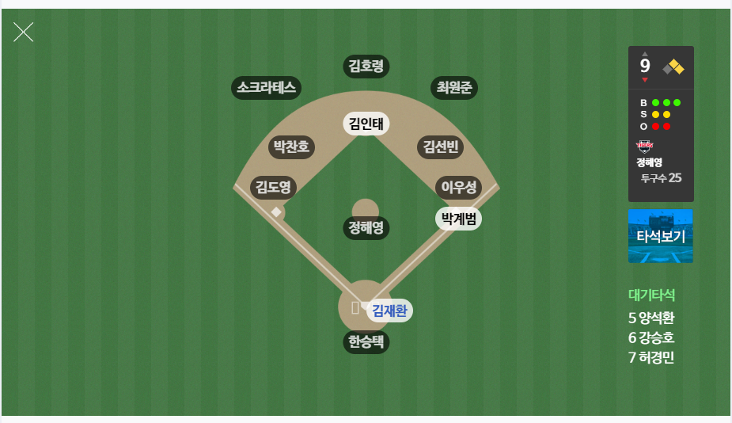
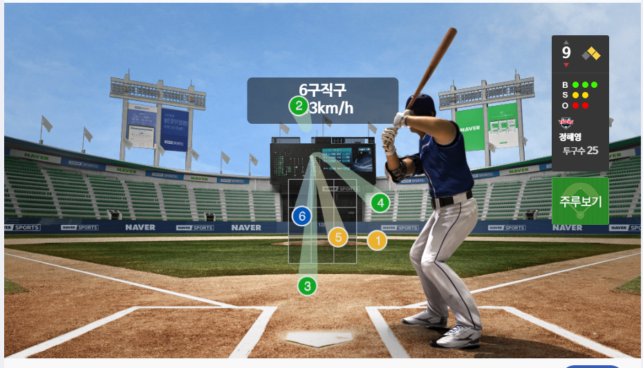
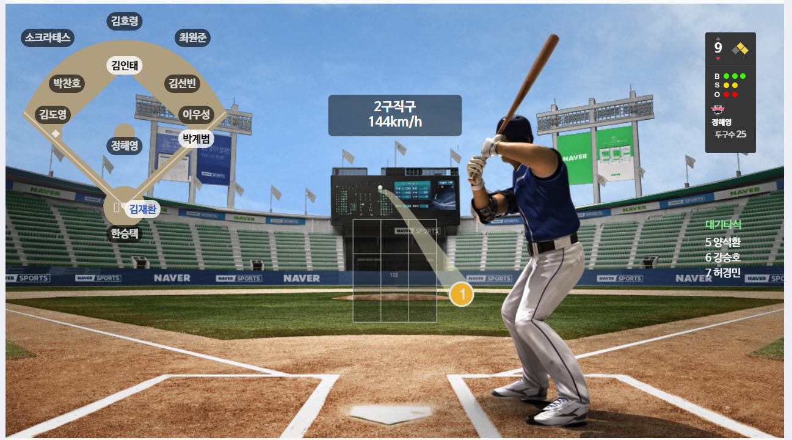

# 소개
**네이버 스포츠 확장**은 네이버 스포츠의 기능을 추가해주는 비공식 확장 프로그램입니다.

## 설치
[크롬 웹 스토어 링크](https://chromewebstore.google.com/detail/%EB%84%A4%EC%9D%B4%EB%B2%84-%EC%8A%A4%ED%8F%AC%EC%B8%A0-%ED%99%95%EC%9E%A5/ahaflmidblgiboicmmfoeppomhgdildm?hl=ko&authuser=0)

## 기능
야구 중계 화면의 2가지 UI를 하나로 합쳐줍니다. 
### 이전

### 이후

## 목적
야구 보다가 짜증나서 만듬

